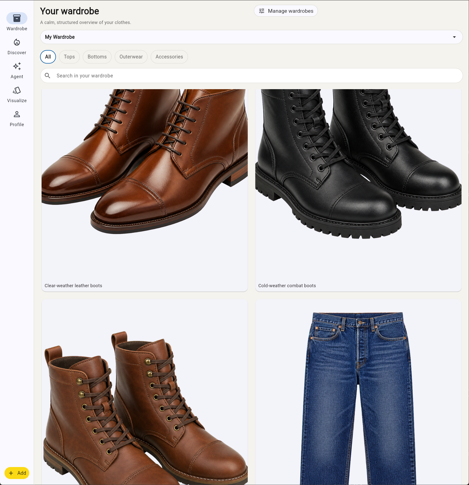
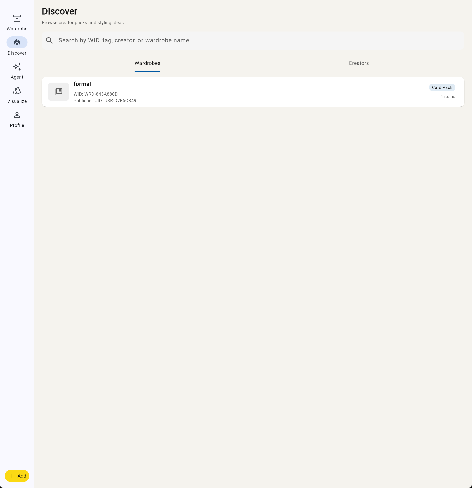
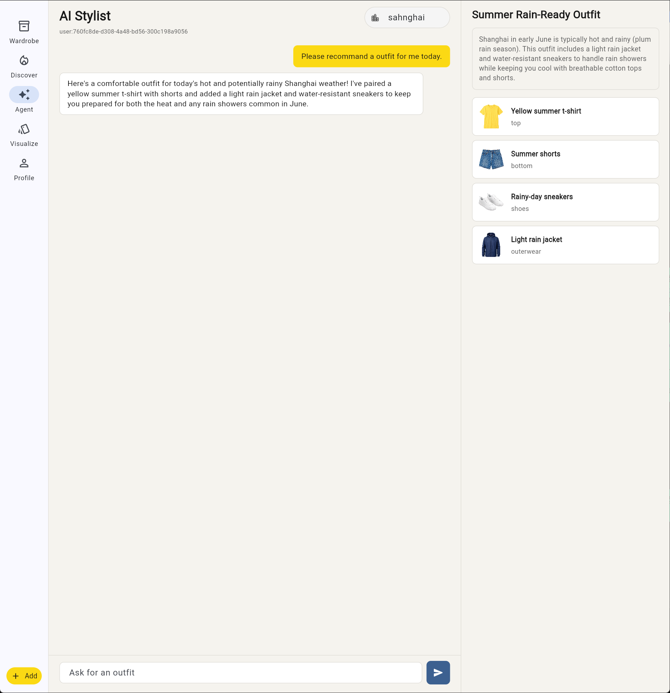
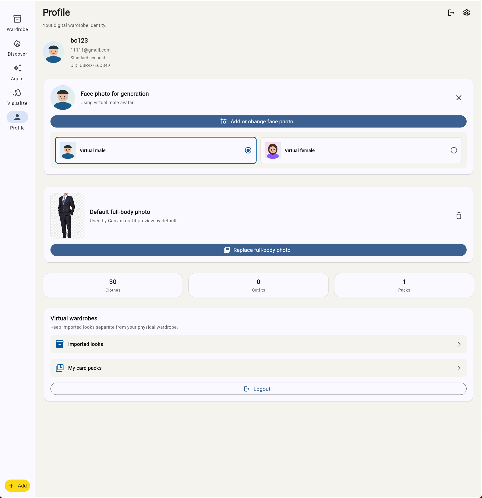
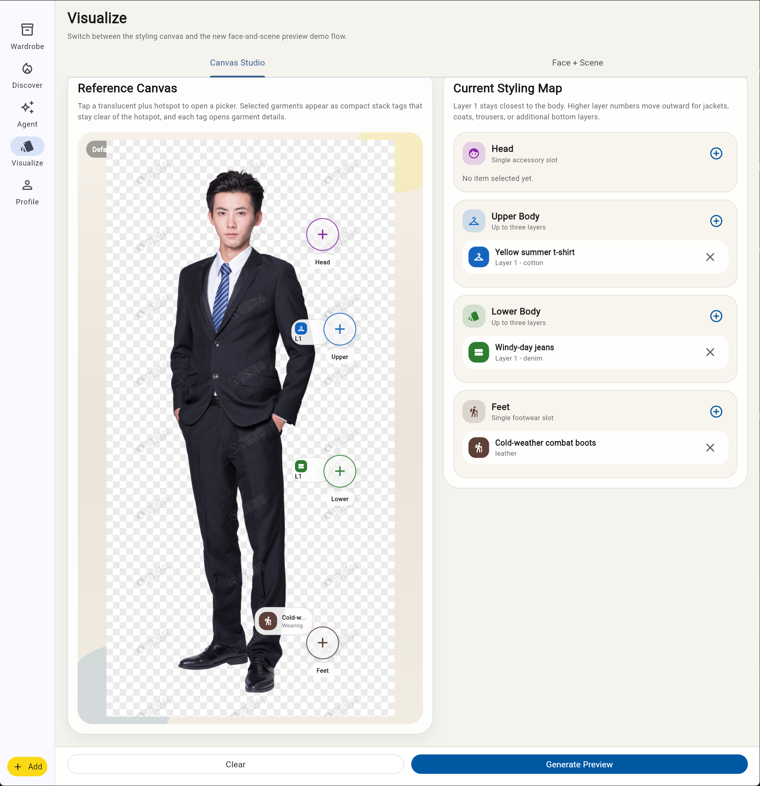
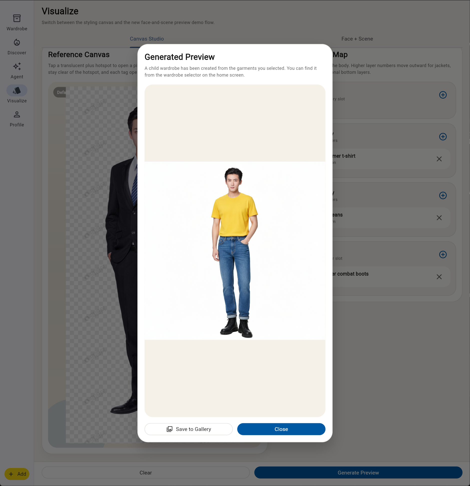
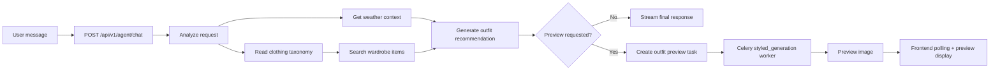

# AI Wardrobe Master

AI Wardrobe Master is a Flutter + FastAPI wardrobe assistant that turns a user's closet into an interactive styling workspace. It combines wardrobe management, creator card packs, an Agent-based stylist, user try-on assets, and outfit preview generation into one local product experience.

<p>
  
</p>

The main workspace keeps clothing assets visible, searchable, and ready for downstream styling flows. The product is intentionally built around real wardrobe items rather than abstract outfit text, so recommendations can be inspected, reused, and visualized.

## Product Features

The wardrobe workspace above is the product's anchor screen: it keeps imported garments searchable, category-aware, and visually ready for Agent recommendation and preview generation.

| Card Pack Discovery | AI Stylist Agent |
| --- | --- |
|  |  |
| Users can browse published creator card packs and shared styling ideas without mixing them into their private wardrobe. This keeps public inspiration separate from owned garments while still making card-pack items available as reusable style references. | Users can ask for outfit help in natural language. The Agent reads the request, checks weather and wardrobe metadata, searches usable garments, and returns a wearable outfit with item-level evidence. |

| Try-On Profile Assets | Outfit Preview Canvas |
| --- | --- |
|  |  |
| Users can manage the generation assets required for try-on previews, including the default full-body image used as the visual base for outfit generation. | Users can review selected garments before generation, assign them to body regions, and control layer order so the backend receives an explicit preview request. |

<p align="center">
  
</p>

Preview generation turns the selected garments and profile image into a frontend-reviewable outfit result after the backend task completes.

## Core Capabilities

AI Wardrobe Master currently focuses on four connected workflows. Users can maintain a visual wardrobe, browse published card packs, ask the AI Stylist for weather-aware outfit recommendations, and generate try-on previews from selected garments and a default full-body image.

The Agent is not just a single prompt wrapper. The backend exposes `POST /api/v1/agent/chat` as a streaming SSE endpoint, and the frontend displays user-readable execution steps while the Agent runs. The final response includes the recommendation, selected wardrobe items, and optional preview task metadata when the user asks for an outfit preview.



## Repository Layout

```text
AI_Wardrobe_Master/
├── ai_wardrobe_app/              # Flutter frontend
├── backend/                      # FastAPI backend, Agent services, Celery tasks
├── documents/                    # Architecture, API, data model, and feature docs
│   └── readme/assets/            # README feature screenshots
├── test/clothing/                # Prepared Agent test clothing metadata and PNG images
├── docker-compose.yml            # PostgreSQL, Redis, backend, workers, DreamO service
└── README.md
```

## Prerequisites

Install or prepare the following:

- Docker Desktop, used for PostgreSQL and Redis.
- `uv`, used for the backend Python environment.
- Flutter SDK and Chrome, used for the Flutter web frontend.
- Backend configuration in `backend/.env`, based on `backend/.env.example`.

Make sure `flutter` and `docker` are available on `PATH` before starting the local services. If either command is unavailable after updating `PATH`, restart PowerShell and try again.

## Local Startup

Start the services in this order during normal development: database, backend, preview worker, frontend.

### 1. Start PostgreSQL And Redis

From the repository root:

```powershell
docker compose up -d db redis
```

The backend expects PostgreSQL on `localhost:5432` and Redis on `localhost:6379`, with development credentials configured in `backend/.env`.

### 2. Start The Backend

Open a new PowerShell terminal:

```powershell
cd backend
uv sync
uv run alembic upgrade head
uv run uvicorn app.main:app --reload --port 8000
```

The API documentation should be available at:

```text
http://localhost:8000/docs
```

### 3. Start The Preview Worker

Outfit preview generation is processed by Celery, not directly inside the FastAPI request. Keep the backend running, then open another PowerShell terminal:

```powershell
cd backend
uv run celery -A app.core.celery_app.celery_app worker -Q styled_generation --pool=solo --concurrency=1 --loglevel=info
```

Without this worker, preview tasks can be created but will remain queued while the frontend keeps polling.

### 4. Start The Flutter Frontend

Open another PowerShell terminal:

If your PowerShell session already recognizes Flutter, the shorter commands also work:

```powershell
cd ai_wardrobe_app
flutter pub get
flutter run -d chrome
```

The Flutter web app will open in Chrome on a local development port, for example:

```text
http://localhost:62735
```

The frontend API base URL defaults to:

```text
http://localhost:8000/api/v1
```

For Android emulator testing, the frontend uses `10.0.2.2` by default instead of `localhost`.

## Docker Compose Full Stack

For a broader backend stack, you can run:

```powershell
docker compose up --build
```

This starts PostgreSQL, Redis, the FastAPI backend, Celery workers, and the DreamO service. DreamO may require GPU support depending on the local setup.

Common Docker commands:

```powershell
docker compose logs -f backend
docker compose down
docker compose down -v
```

`docker compose down -v` removes the database volume, so use it only when you want a clean local reset.

## Model Support

AI Wardrobe Master separates model providers by workflow. Runtime API keys must be configured in `.env` files and must not be committed to Git.

| Workflow | Provider / Model | Configuration | Official Site |
| --- | --- | --- | --- |
| Clothing classification | Roboflow Workflow | `ROBOFLOW_API_URL`, `ROBOFLOW_API_KEY`, `ROBOFLOW_WORKSPACE_NAME`, `ROBOFLOW_WORKFLOW_ID` | https://roboflow.com / https://docs.roboflow.com/workflows |
| Outfit recommendation Agent | OpenAI-compatible chat provider, default example: SiliconFlow | `LLM_PROVIDER_NAME`, `LLM_BASE_URL`, `LLM_API_KEY`, `LLM_MODEL` | https://docs.siliconflow.cn |
| Outfit preview generation | DashScope Wan `wan2.6-image` | `DASHSCOPE_API_KEY` | https://help.aliyun.com/zh/model-studio/wan-image-generation-api-reference |
| 2D-to-3D clothing asset generation | Tencent Hunyuan3D-2 | `HUNYUAN3D_ENABLED`, `HUNYUAN3D_MODEL_PATH`, `HUNYUAN3D_*` | https://github.com/Tencent-Hunyuan/Hunyuan3D-2 / https://huggingface.co/tencent/Hunyuan3D-2 |
| Styled fashion portrait generation | DreamO local service | `DREAMO_SERVICE_URL`, `DREAMO_DEFAULT_VERSION`, `DREAMO_*` | https://github.com/bytedance/DreamO |